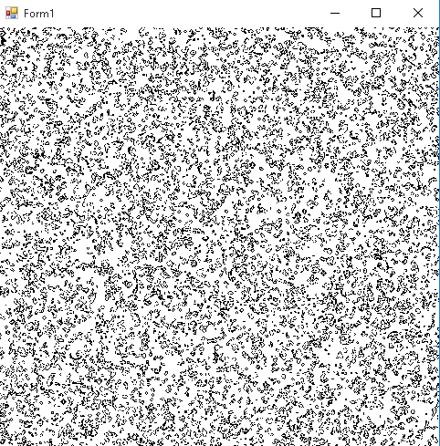

Life-like automata
==================

Introduction
------------

[Conway's Game of Life](https://en.wikipedia.org/wiki/Conway's_Game_of_Life) is a cellular automaton where each cell can be in one of two states (dead or alive) based on rules depending on the number of live neighbors in the previous generation:

- a dead cell with exactly two live neighbors is **born** at the next generation
- a live cell with two or three live neighbors **survives**
- in any other case a dead cell stays dead and a live cell dies.

By changing the birth and survival conditions it's possible to create a class of automata called "Life-like". A compact notation can describe the rules for any of these automata with a string in the form `B3678/S34678` (the example is the rule set for Day and Night), which is read as:

- a dead cell is **born** if it has 3, 6, 7 or 8 live neighbors
- a live cell **survives** if it has 3, 4, 6, 7 or 8 live neighbors.

Some interesting Like-like automata are:

- The original Game of Life: B3/S23
- Fredkin's Replicator: B1357/S1357
- Seeds: B2/S
- Life Withouth Death: B3/S12345678
- 34 Life: B34/S34
- Diamoeba: B35678/S5678
- 2x2: B36/S125
- Highlife: B36/S23
- Day and Night: B3678/S34678
- Morley's Move: B368/S245
- Anneal: B4678/S35678.

The following are screenshots of four different Life-like automata with a random initial state:

Features
--------

This program in C# implements a `Life` class which stores a rule set and a playing field (with toroidal wrapping, i.e. the neighbors of one side of the field are the cells at the opposite side). Counting the number of neighbors of each cell is decoupled from the actual state update, so they can be easily parallelized.

A Windows Form generates a random initial field and displays the evolution of the game over time.

Remarks
-------

- The `Update()` method is parallelized, but still runs on CPU, each cell is drawn with low level functions
- In order to allow any rule to be "played", the `Update()` method implements the naive (`O(n)`) algorithm, instead of faster algorithms (e.g. [Hashlife](https://en.wikipedia.org/wiki/Hashlife)).